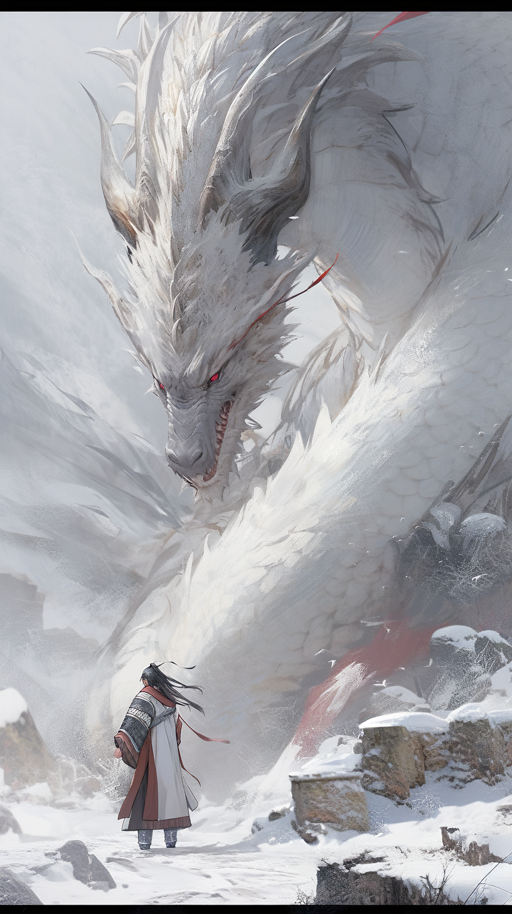

#### 巨大可怕的物体，在雪山上，高贵的景观，艺术的景观，云中男孩，白袍，战斗金龙，天堂，地狱，银龙，秘密，美丽，壮丽，辉煌，强烈的尺寸对比，史诗，电影，中国银龙，吴关中，张克春，雪山，巨大的银龙，摄影，超细节，概念游戏设计，插图，POV视图，极低角度视图巨大，全身，银龙，极具大气感的底部视野，光圈50mm镜头
> Huge fearful object, on a snowy mountain, noble landscape, artistic landscape, boy in clouds wearing white robe, fighting golden dragon, heaven, hell, silver dragon, secret, beautiful, magnificent, brilliant, strong size contrast, epic, film, Chinese silver dragon, Wu Guanzhong, Zhang Kechun, snowy mountain, huge silver dragon, photography, super detail, concept game design, illustration, POV view, extreme low angle view Huge, full body, silver dragon, extreme bottom view with superb atmospheric feel, aperture 50mm lens --ar 9:16 --q 2 --niji 5 --v 5

 

