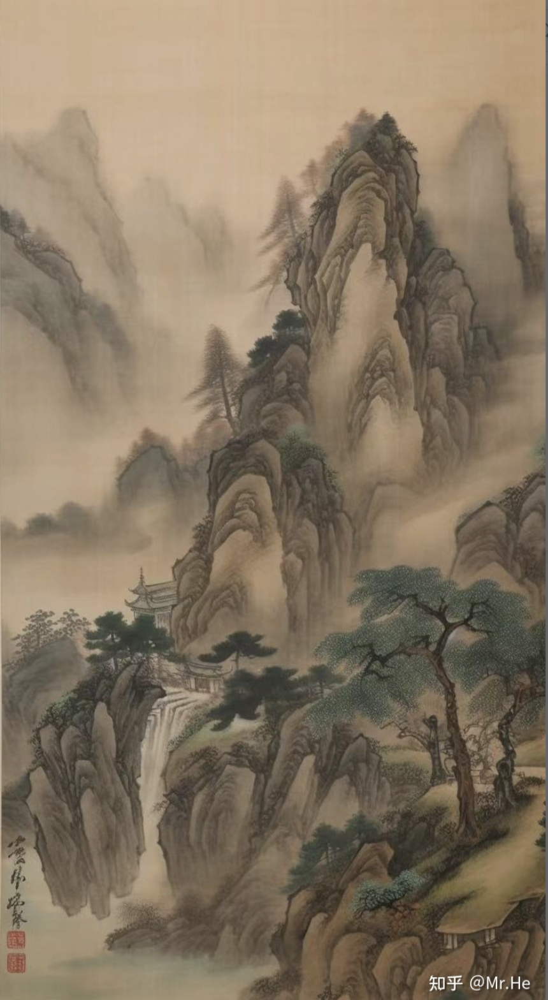
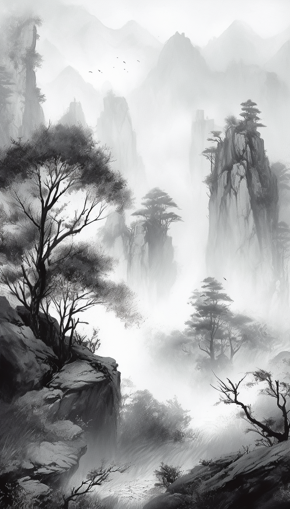

#### 用张大千画山水
>mountains, by zhang daqian painting, --v 5 --ar 9:16

 

#### 古风山水：中国传统绘画里面有山川溪流，古建筑，花鸟鱼虫，仙鹤，扇子，云雾等，比如 河流可以说rivers，也可以说stream，效果就完全不一样
>Chinese landscape mapdistant mountains, clear rivers, ancient buildingsships, birds, clouds and mist, brilliant light, longdistance perspective, ultra-wide angle, majesticultra-vivid colors, ultra-bright light, ultra-high imagequality. ultra-high detail, depth of field, movie quality, 100mm lens, flat illustration style --ar 9:16 --v 5 --s 750

 

#### 宋徽宗花鸟画
> birds，flowers， by Emperor Huizong of Song Dynasty --ar 9:16 --v 5

 

#### 范宽山水
> Chinese landscape painting by Fan Kaun, a chinese painter in Song Dynasty in 900 years of Park

 

#### 深闺美女
> A cat, a girl, spring, Chinese classical painting,​ink render, --ar 16:9 --v 5

 

#### 梅花
> A traditional Chinese painting, depicting a branch of bright red apricot blossoms bursting out of a wall. The delicate petals and branches are rendered in exquisite detail, with a soft and gentle color palette that captures the beauty and fragility of nature. The image evokes feelings of vitality, growth, and renewal, as well as the passing of time and the ephemeral nature of life

 

#### 断肠人在天涯
> a man ,a horse, a long narrow path, desolate, rugged, windswept, lonely, melancholy, despondent , sunset, chinese classical painting, --ar 16:9 --v 5

 

#### 设计一个古典咖啡杯
> Firstly, I chose traditional white porcelain as the material for the coffee cup because white porcelain has the characteristics of delicate texture and good light transmission, and it is also a traditional Chinese porcelain material.Secondly, I used deep blue as the main color. In traditional Chinese culture, deep blue symbolizes nobility, elegance, and calmness, which complement the temperament of coffee.Then, I designed the cup with landscape as the theme, using smooth lines to outline a beautiful landscape pattern, and creating a mountainous and undulating shape for the coffee cup, which not only has the charm of traditional Chinese landscape painting, but also has a modern sense.Finally, to highlight the ancient style, I added cloisonné to the mouth and handle of the coffee cup. Cloisonné was considered a luxury in ancient China and is a representative of court art, which, when paired with the texture of white porcelain, is even more elegant and noble,4K,--ar 9:16 --q 2 --v 5

 

#### 雾，中国山水画，水墨渐变，柔和细腻的线条，变化和分层的形状，水墨渲染，泼墨技术，纹理笔画，点画技术，焦距10 - 24mm，光圈f/ 8 - f/ 11，快门速度1/ 30s - 1/ 125s, ISO 100 - 400，日光白平衡，对焦模式单自动对焦，测光模式矩阵，镜头稳定开启
> Fog, , Chinese Landscape Painting, Ink gradients, Soft and delicate lines, Varied and layered shapes, Ink wash rendering, Splashing ink technique, Texture strokes, Dotting technique, Focal Length 10 - 24mm, Aperture f/ 8 - f/ 11, Shutter Speed 1/ 30s - 1/ 125s, ISO 100 - 400, White Balance Daylight, Focus Mode Single Autofocus, Metering Mode Matrix, Lens Stabilization On --v 5 --ar 4:7 --s 750

 

