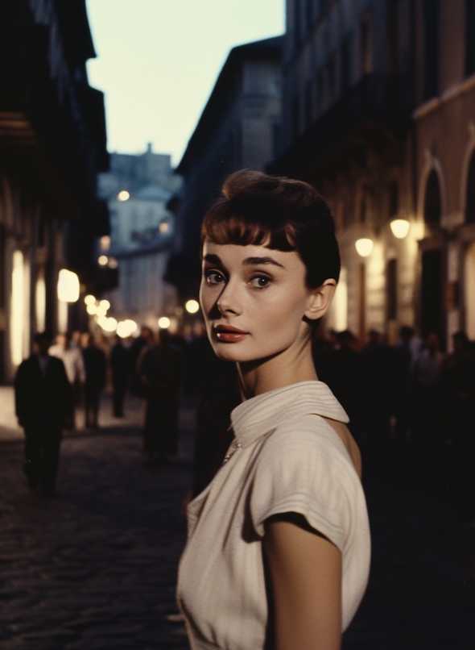

#### 色彩丰富的金箔纸艺术发光动画女孩穿着令人惊叹的短汉服
>rich colors gold foil paper art luminism anime girl wearing a stunning short hanfu dress cel-shaded

 

#### 齐白石的艺术作品，美丽的艺伎与雄伟的天堂鸟，雄伟的马和美丽的天鹅全身姿势的混合
>Artwork by Qi Baishi, beautiful geisha hybrid with a majestic bird of paradise, majestic horse and beautiul swan full body pose

 

#### 美神从虚空中升起，赛博朋克，停留在时间里，大气，神圣，周围的黄金，浙江画派，水墨，中国艺术风格
>Beauty God rises from the void, cyberpunk, stops in time, atmospheric, divine, surrounding gold, The Zhejiang school of painting, ink wash, Chinese art style

 

#### 一个美丽的中国女孩，垂她的头发，中国古代的衣服，美丽的脚，身材，完美的细节
>A beautiful Chinese girl, Drape her hair， Chinese ancient clothes, beautiful feet, body figure, perfect details, 8 k --v 5 --ar 9:16 --q 5 --s 750

 

#### 极简风格，设计女性风格图，时尚优雅大气，大师风格，插画笔触，黑白线条，纯色背景，高清，8k
>Minimalist style, design a women's style diagram, fashion elegant atmosphere, master style, illustrator strokes, black and white lines, solid color background, HD, 8k

 

#### 一个穿着浴袍的中国漂亮女孩，d罩杯，全身拍摄，细腰，肖像画的代表作，动画风格，32k uhd，条纹核，浅栗色和深蓝色，条纹核，引人注目，女性化的身体，ue5,8K，高清，皮克斯风格，摄影，超写实，渐变背景，精美的3D渲染，3D, 8K, Blender, C4D，新tane渲染
>a chinese beautiful girl wearing a bathrobe,D-cup,full-body shot,slim waist, a masterpiece of portrait paintings, in the style of Anime, 32k uhd, stripcore, light maroon and dark blue, stripcore, eye-catching, feminine body, ue5,8K,HD,Pixar style, photography, super realism, gradient background, exquisite 3D rendering, 3D, 8K, Blender, C4D, octane rendering

 

#### 描绘name1和name1在紫禁城前cosplay，由Nicky Nesterenko，人物肖像画，脸，饱和，电影
>depicting flirtatious aphrodite cosplay of {name1} and {name2} in front of Forbidden City by Nicky Nesterenko, characer portrait painting , face, saturated, cinematic --v 5 --ar 16:9

 

#### 五彩缤纷的彩色版画，一个有着宁静表情的艺伎，灵感来自章子怡、浮世绘、葛饰北斋，一个精致的樱花花卉头饰，粉红色和蓝色的阴影，微妙的纹理和图案，传统和现代元素的混合
>A colorful chromolithography print, a Geisha with a serene expression, inspired by Zhang Ziyi, Ukiyo - e, Katsushika Hokusai, a delicate floral headdress with cherry blossoms, shades of pink and blue, subtle textures and patterns, a mix of traditional and contemporary elements --v 5 --ar 16:9

 

#### 地狱是由一群充满激情的女性身体组成的，美丽的轮廓，放松的姿势，享受自己，夸张，长腿，女性身体的形状，恶魔般的美丽。充满激情的身体。热，炽热，激烈。深色漫射色。迷幻的。霓虹灯。令人难以忘怀，令人恐惧。 4k 风格的詹姆斯·让，莫比乌斯。图画小说插图。超详细。非常深的颜色，深色的背景。深霓虹红 --v 5 --ar 16:9
>hell is made of bunch of female passionate bodies, beautiful contours, relaxing positions, enjoying themselves, extatic, long legs, shapes of woman body, demonic beauty. passionate bodies. heat, fiery, intense. dark diffused colors. psychedelic. neons. haunting, terrifying. 4k style of james jean, moebius. graphic novel illustration. ultradetailed. very dark colours, dark background. dark neon red --v 5 --ar 16:9

 

#### 20世纪80年代，奥黛丽·赫本走在罗马的街道上，这是一部名为《罗马假日》的电影风格，高度细节，低对比度，逼真的灯光，摄影，由富士相机拍摄
>Audrey Hepburn walking back through the streets of Rome in the 1980s, in the style of a film called Roman Holiday, highly detailed, low contrast, realistic lighting, cinematography, shot by a Fuji camera

 

#### Jisoo的肖像，一只猫在她身边，被未来主义的城市景观包围，立体派风格，灵感来自巴勃罗·毕加索和乔治·布拉克，视觉风格的故障艺术和赛博朋克
>Portrait of Jisoo with a cat by her side, surrounded by a futuristic cityscape, in the style of Cubism, inspired by Pablo Picasso and Georges Braque, in the visual style of glitch art and cyberpunk

 

